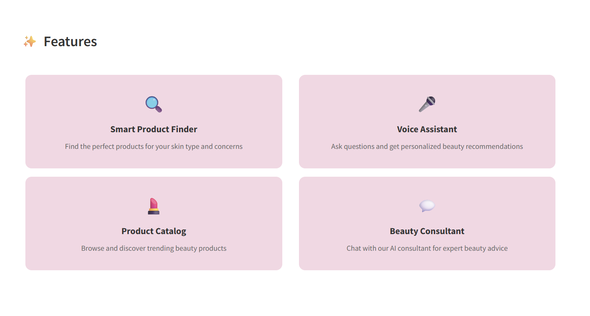
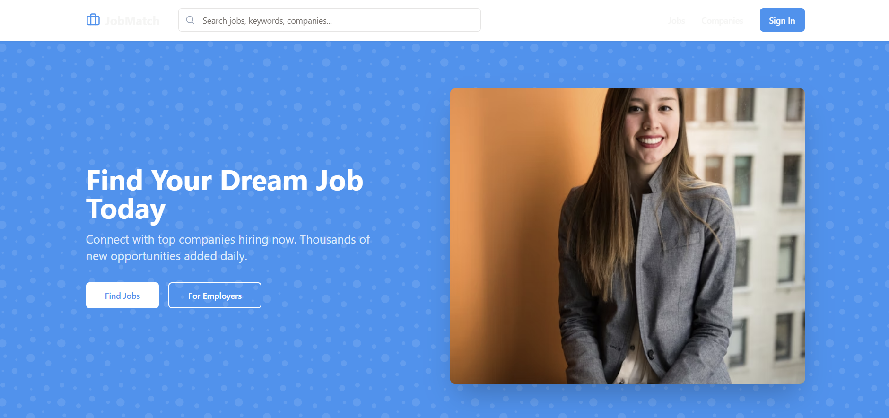
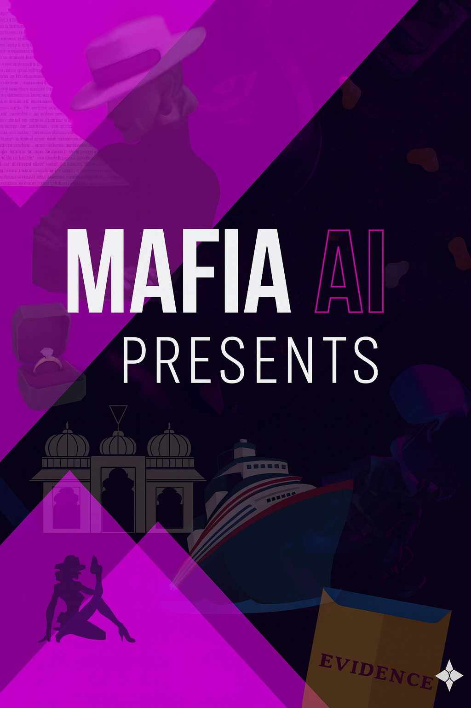
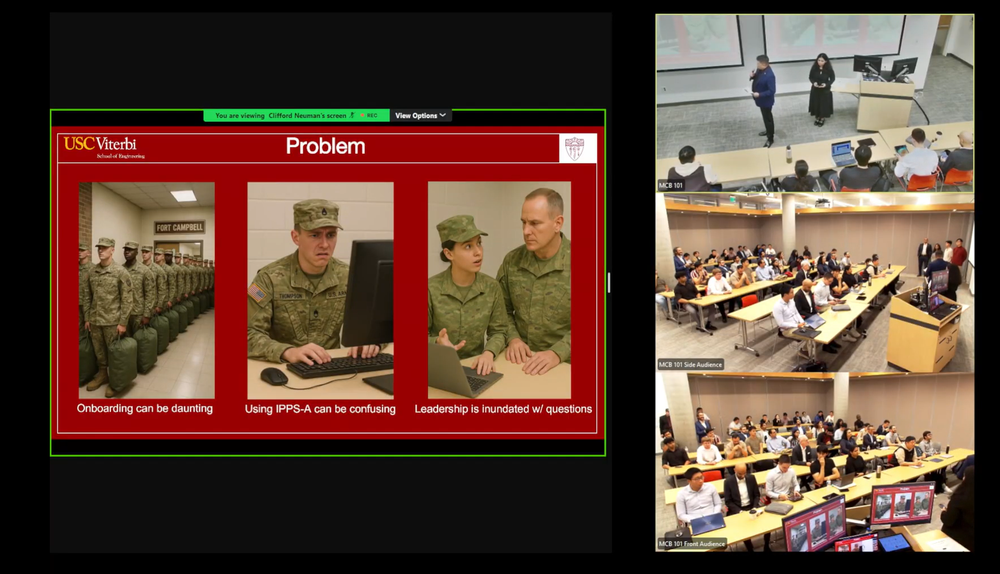

<!--
✨ README template for your GitHub profile
👉 Replace every `heenakousar` with your actual GitHub username.
👉 Put all images in an `/assets` folder with the same filenames used below.
-->

  

  

 

  

  

    <h2 style="color:#ffffff; margin: 0 0 10px; font-size: 26px;">3D Portfolio Snapshot</h2>
    

      I design and build intelligent systems – from medical image segmentation and financial
      intelligence platforms to job-matching portals and interactive AI storytelling experiences.
    

  

---

  
  
  

  

---

## 👩‍💻 About Me

- 🎓 Computer Science & AI enthusiast focused on real-world impact  
- 🧠 Experience with deep learning for **Brain MRI tumor segmentation**  
- 📊 Passionate about **data-driven decision systems** & financial intelligence  
- 🌐 Love building polished, user-centric web apps & dashboards  
- 🧩 Always exploring new tools, architectures and human-centered design

---

## 🛠️ Tech Stack (with Logos)

  <!-- Languages -->
  
  
  
  
  

  <!-- Web stack -->
  
  
  
  

  <!-- Data & ML -->
  
  
  

  <!-- Tools & Platforms -->
  
  
  
  

> 💡 Add / remove icons above so they match the skills listed on your live portfolio exactly.

---

## 🚀 Highlight Projects (with Graphics)

### 💄 Beauty Product Recommendation Assistant

  

- **Smart Product Finder, Voice Assistant, Product Catalog & Beauty Consultant**
- Matches skincare products to a user’s skin type, concerns and budget  
- Stack: Frontend UI, recommendation logic, interactive feature cards

---

### 🧠 Improved U-Net for Brain Tumor Segmentation

  

- Research work: **“Improved UNet Framework with Attention for Semantic Segmentation of Tumor Regions in Brain MRI Images”**  
- Published in **International Research Journal of Engineering and Technology (IRJET)**, Vol. 9, Issue 7 (July 2022)  
- Focus: Attention-enhanced U-Net, precise tumor region segmentation & clinical interpretability

---

### 📈 Financial Market Intelligence Platform

  

- Real-time visualization of **price movements, indicators and trading signals**  
- Designed for analysts to explore trends, manage risk & spot anomalies  
- Stack: Data pipelines, analytics layer, interactive charting dashboard

---

### 💼 JobMatch – Advanced Job Portal Application

  

- Modern job portal with **search, filters, employer view and candidate dashboard**  
- Focus on **clean UX** and clear CTAs (“Find Jobs”, “For Employers”)  
- Stack: Full-stack web app integrating job data & authentication

---

### 🎭 Mafia AI – Interactive Story Experience

  

- AI-driven interactive story / investigation experience  
- Combines **visual storytelling**, branching choices and evidence exploration  
- Built to experiment with **narrative design + AI reasoning**

---

### 🪖 Project Singularity – Human-Centered Onboarding

  

- Focused on **human-centered onboarding** for complex military systems  
- Identifies onboarding pain points, proposes **AI-assisted training & support**  
- Presented with multi-audience views: leadership, operators & trainers

---

## 📚 Publications & Recognition

- 🧠 **Improved UNet Framework with Attention for Semantic Segmentation of Tumor Regions in Brain MRI Images**  
  – Published in **IRJET** (International Research Journal of Engineering and Technology), Volume 9, Issue 7, July 2022  
  – Demonstrates attention-based deep learning for accurate brain tumor segmentation  
- 🏅 Certificate of publication & impact factor **7.529** featured above

---

## 📊 GitHub Statistics

  

  

  

  

---

## 🏆 Ranks • Records • Medals

  

> These dynamic trophies and graphs act as your **digital medals, ranks and records**, updating automatically as you grow.

---

## 🤝 Let’s Connect

  
  
  

---

  ⭐ If you like my work, consider starring some repositories – it really motivates me!

